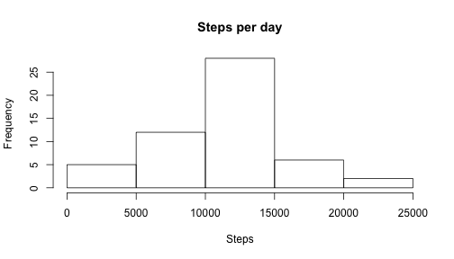
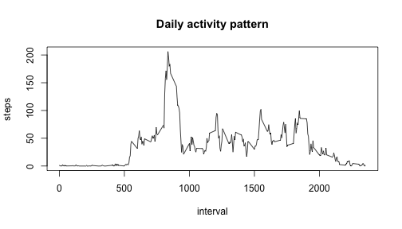
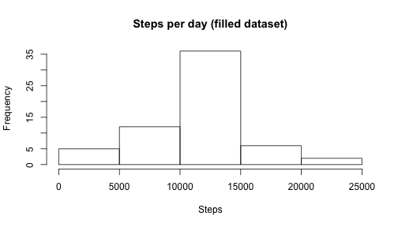
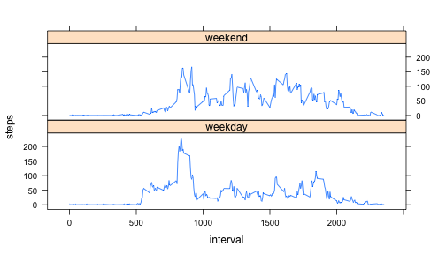

## Loading and preprocessing the data


```r
unzip('activity.zip')
activity <- read.csv('activity.csv')
activity$date <- as.Date(activity$date)
```

## What is mean total number of steps taken per day?


```r
steps_per_day <- aggregate(steps ~ date, activity, sum)
hist(steps_per_day$steps, xlab = 'Steps', main = 'Steps per day')
```

 

```r
steps_mean <- format(mean(steps_per_day$steps))
steps_median <- format(median(steps_per_day$steps))
```

The mean of the total number of steps taken per day is 10766.19 and the median is 10765.

## What is the average daily activity pattern?


```r
avg_activity <- aggregate(steps ~ interval, activity, mean)
plot(avg_activity, type = 'l', main = 'Daily activity pattern')
```

 

```r
sorted_activity <- avg_activity[order(avg_activity$steps, decreasing = TRUE),]
highest_activity_interval <- sorted_activity[1, 'interval']
```

Interval #835 contains the maximum number of steps.

## Imputing missing values


```r
missing_activity_cond <- is.na(activity$steps)
missing_activity_cnt <- sum(missing_activity_cond)
```

The total number of missing values is 2304.


```r
filled_activity <- as.data.frame(activity)
for (i in 1:nrow(filled_activity)) {
    if (is.na(filled_activity[i, 'steps'])) {
        interval <- filled_activity[i, 'interval']
        filled_activity[i, 'steps'] <- avg_activity[avg_activity$interval == interval, 'steps']
    }
}
steps_per_day2 <- aggregate(steps ~ date, filled_activity, sum)
hist(steps_per_day2$steps, xlab = 'Steps', main = 'Steps per day (filled dataset)')
```

 

```r
steps_mean <- format(mean(steps_per_day2$steps))
steps_median <- format(median(steps_per_day2$steps))
```

The mean of the total number of steps taken per day is 10766.19 and the median is 10766.19. The median differs from the first part of the assignment, and it've become equal to the mean value.

## Are there differences in activity patterns between weekdays and weekends?


```r
library(lattice)
filled_activity$day_type <- factor(sapply(filled_activity$date, function(x) {
    if (weekdays(x) %in% c('Saturday', 'Sunday')) {
        'weekend'
    } else {
        'weekday'
    }
}))
avg_activity_day_type <- aggregate(steps ~ interval + day_type, filled_activity, mean)
xyplot(steps ~ interval | day_type, avg_activity_day_type, type = 'l', layout = c(1,2))
```

 
